  <picture>
    <source media="(prefers-color-scheme: dark)" srcset="./assets/dark_mode.svg" />
    <source media="(prefers-color-scheme: light)" srcset="./assets/light_mode.svg" />
    
  </picture>

## 🤝 Connect with me

- Personal Website: https://xqsit.dev
- LinkedIn: https://www.linkedin.com/in/xqsit94
- Email: <manikandan@xqsit.dev>

  
Experience (9 years)

  #### Sirine.ai B.V
  *Full Stack Engineer*

  Jul 2025 - Present (1 yr) • India

  ---
  #### Oreala B.V
  *Full Stack Engineer*

  Apr 2022 - Jun 2025 (3 yr, 2 m) • India

  ---
  #### Colan Infotech Private Limited
  *Software Engineer*

  Jul 2018 - Mar 2022 (3 yr, 8 m) • Chennai, Tamil Nadu, India

  ---
  #### Expose InfoTech India Pvt Ltd
  *PHP Developer*

  Dec 2017 - Jun 2018 (6 m) • Calicut Area, India

  ---
  #### Slogics Solutions
  *Web Developer*

  Nov 2016 - Dec 2017 (1 yr, 1 m) • Chennai Area, India

  ---
  

  
Education

  #### Madha Engineering College
  *Bachelor of Engineering (B.E.), Computer Science*

  2012 - 2016

  ---
  #### Assisi Matriculation School - India
  *Primary and Secondary Examinations, General Studies*

  1997 - 2012

  ---
  

